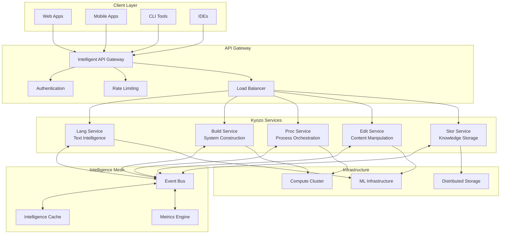
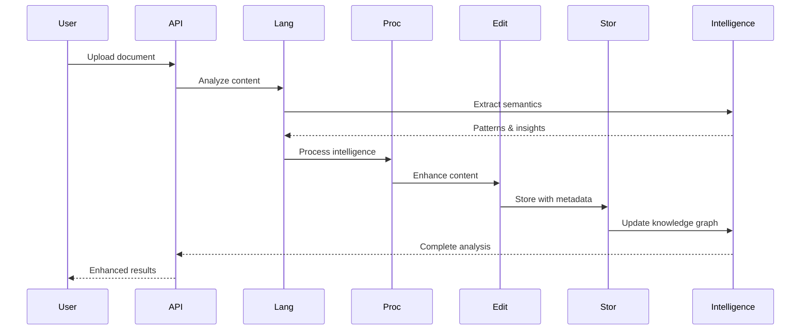
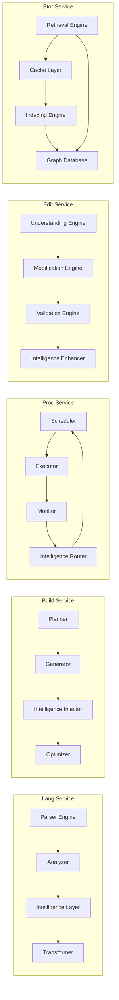
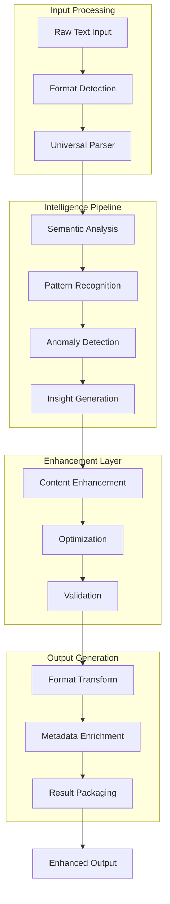
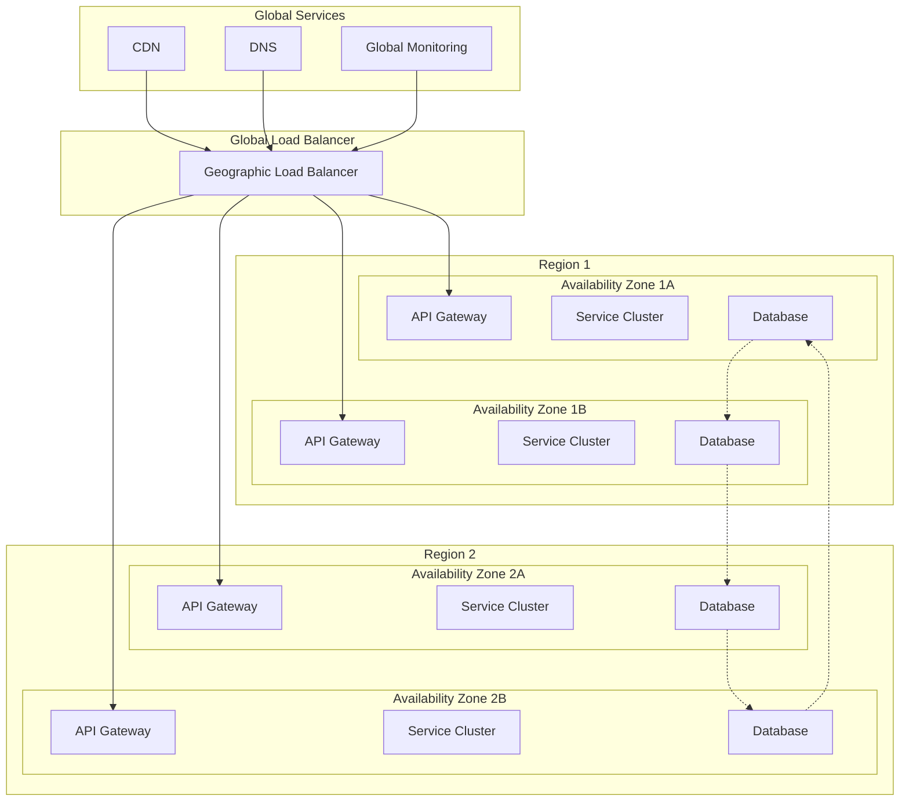
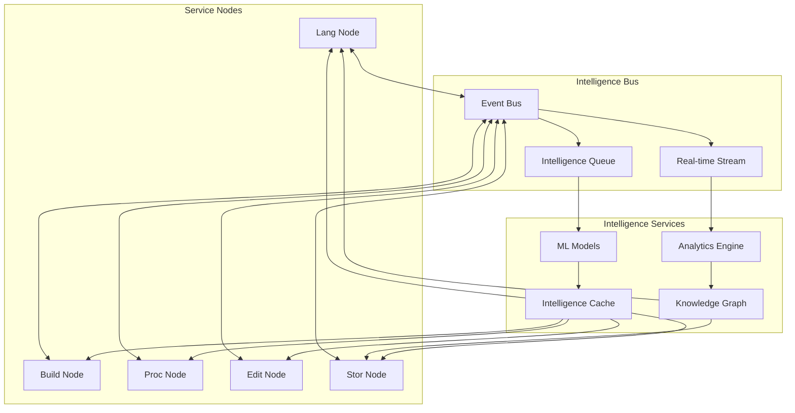
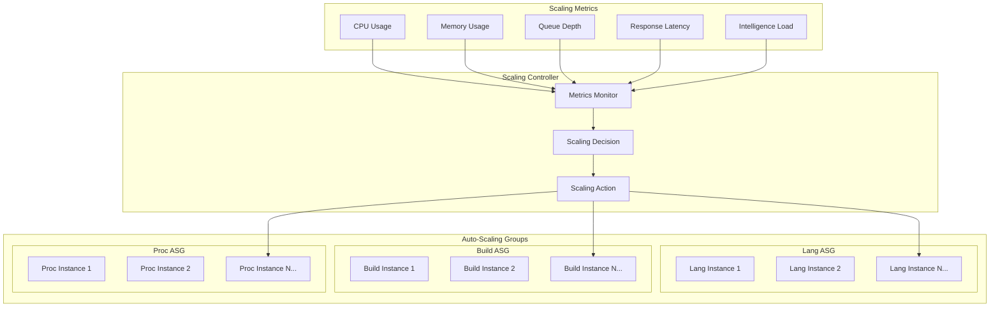
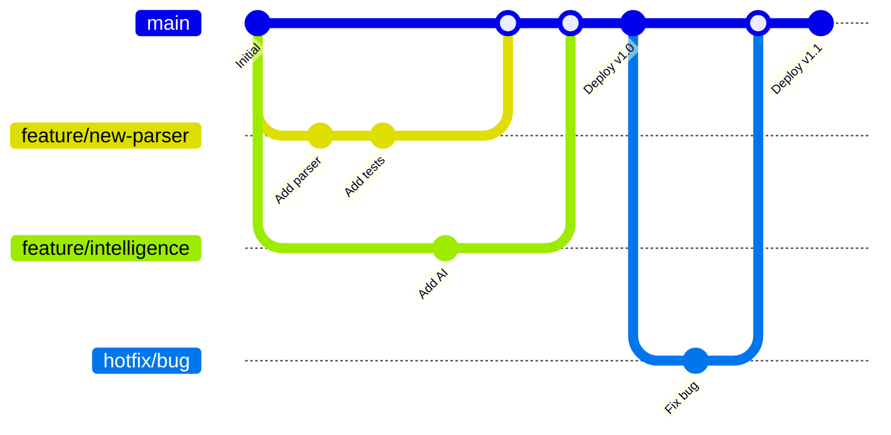
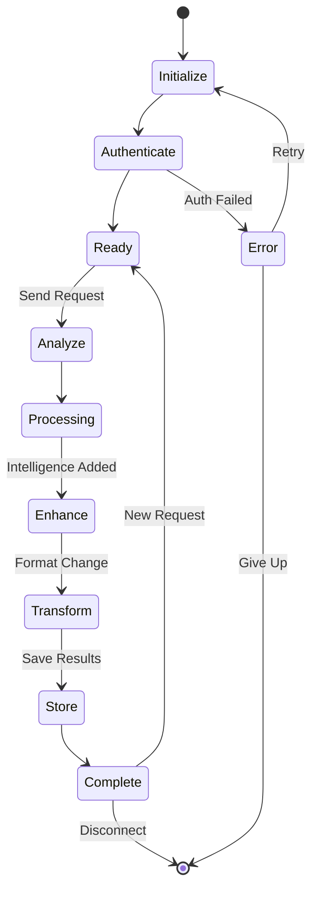

# Kyozo Architecture Diagrams
## Visual Guide to Universal Intelligence

### 1. Platform Overview

### 2. Intelligence Flow

### 3. Service Architecture

### 4. Data Flow Patterns

### 5. Deployment Architecture

### 6. Security Architecture

```mermaid
graph LR
    subgraph "External"
        Client[Client Application]
    end
    
    subgraph "Edge Security"
        WAF[Web Application Firewall]
        DDoS[DDoS Protection]
        TLS[TLS Termination]
    end
    
    subgraph "Authentication Layer"
        OAuth[OAuth Provider]
        APIKey[API Key Validation]
        JWT[JWT Verification]
    end
    
    subgraph "Authorization"
        RBAC[Role-Based Access]
        Scope[Scope Verification]
        Rate[Rate Limiting]
    end
    
    subgraph "Service Security"
        Encrypt[Encryption at Rest]
        Audit[Audit Logging]
        Secrets[Secret Management]
    end
    
    Client --> WAF
    WAF --> DDoS
    DDoS --> TLS
    TLS --> OAuth
    OAuth --> APIKey
    APIKey --> JWT
    JWT --> RBAC
    RBAC --> Scope
    Scope --> Rate
    Rate --> Encrypt
    Encrypt --> Audit
    Audit --> Secrets
```

### 7. Intelligence Mesh Detail

### 8. Scaling Architecture

### 9. Development Workflow

### 10. Client Integration Flow

---

These diagrams provide a comprehensive visual understanding of Kyozo's architecture, from high-level platform overview to detailed service interactions and deployment patterns.