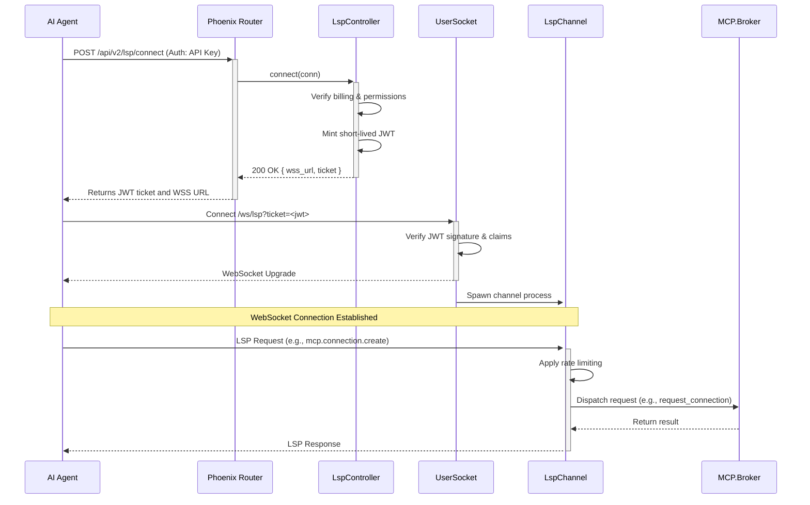

# LANG LSP-MCP Bridge Architecture

## Overview

The LANG platform utilizes the Language Server Protocol (LSP) not just for traditional editor integration, but as the primary authenticated communication layer for AI agents. To provide secure access to powerful backend capabilities like filesystem access, code execution, and git operations, the LSP server acts as a bridge to the **Multi-Connection Protocol (MCP)**.

This document outlines the architecture of this bridge, detailing the authentication flow and the key components that work together to provide a secure, scalable, and robust interface for AI agents.

## Authentication and Connection Flow

Access to the LSP-MCP bridge is a two-stage process designed for security and session management:

1.  **HTTP Ticket Request**: An authenticated client makes a standard HTTP POST request to the main Phoenix application. This request uses a long-lived API key or a standard user session Bearer token for authentication. If successful, the server returns a short-lived JSON Web Token (JWT).
2.  **WebSocket Connection**: The client uses the received JWT to establish a WebSocket connection. The JWT acts as a single-use ticket to authenticate the WebSocket session. Once the connection is established, the client can send and receive LSP JSON-RPC messages.

### Sequence Diagram



## Key Components

### 1. LspController (HTTP)

The initial entrypoint for authentication. It's a standard Phoenix controller responsible for validating the client's right to open an LSP session.

-   **Path**: `lib/lang_web/api/v2/lsp_controller.ex`
-   **Route**: `POST /api/v2/lsp/connect`

**Responsibilities**:
-   Authenticates the user via standard Phoenix plugs.
-   Performs a billing check to ensure the user's organization has service credits.
-   Mints a short-lived (5-minute) JWT with specific claims (`sub`, `org`, `scope: "lsp_ws"`) for the WebSocket connection.

```elixir
# lib/lang_web/api/v2/lsp_controller.ex

def connect(conn, _params) do
  user = AuthHelpers.current_user(conn)
  org = AuthHelpers.current_org(conn)

  with {:ok, :allowed} <- allow_billing(org),
       {:ok, ticket, ttl, cid} <- mint_lsp_ticket(user, org) do
    wss_url = "/ws/lsp?ticket=" <> URI.encode(ticket)
    json(conn, %{wss_url: wss_url, ticket: ticket, ttl: ttl, cid: cid})
  else
    # ... error handling ...
  end
end

defp mint_lsp_ticket(user, org) do
  ttl = 300
  scope = "lsp_ws"
  cid = derive_cid(user.id, org.id)
  claims = %{"sub" => user.id, "org" => org.id, "scope" => scope, "cid" => cid}
  {:ok, token} = Lang.Security.JWT.sign_ticket(claims, ttl: ttl)
  # ... track event ...
  {:ok, token, ttl, cid}
end
```

### 2. UserSocket & LspChannel (WebSocket)

The `UserSocket` is the standard Phoenix entrypoint for WebSocket connections. It is responsible for verifying the JWT ticket from the query parameters before spawning the long-lived `LspChannel` process.

-   **Channel Module**: `lib/lang_web/channels/lsp_channel.ex`

**Responsibilities**:
-   **Authentication (in `UserSocket`)**: Verifies the JWT is valid and unexpired. The user and org IDs from the token are added to the socket assigns for use by the channel.
-   **Message Handling**: The `LspChannel` receives incoming JSON-RPC messages.
-   **Rate Limiting**: Applies rate limiting per client before processing requests.
-   **Dispatch**: Forwards valid requests to the central RPC Router (`Lang.RPC.Router`), which directs them to the appropriate backend service, including the MCP Broker.

```elixir
# lib/lang_web/channels/lsp_channel.ex

def handle_in("json", %{"jsonrpc" => "2.0", "id" => id, "method" => method} = req, socket) do
  params = Map.get(req, "params", %{})
  ctx = Map.get(socket.assigns, :rpc_ctx, %{}) |> Map.put(:channel_pid, self())
  api_key_id = ctx[:api_key_id] || "anon"

  with :ok <- Lang.Security.RedisLimiter.allow?(to_string(api_key_id), method) do
    case Router.dispatch(ctx, method, params) do
      # ... dispatch logic ...
    end
  else
    # ... rate limiting error ...
  end
end
```

### 3. MCP.Broker (Backend)

The `MCP.Broker` is the secure, supervised backend for all high-privilege operations. It is never exposed directly to the network. The LSP channel acts as its authenticated proxy.

-   **Path**: `lib/lang/mcp/broker.ex`

**Responsibilities**:
-   Manages the lifecycle of sandboxed MCP server processes (e.g., for filesystem, git).
-   Enforces security policies, such as which server types are allowed.
-   Manages connection pools and enforces user-level connection limits.
-   Implements circuit breakers to protect against failing servers.
-   Receives requests only from trusted internal sources like the `LspChannel` (via the RPC Router).

```elixir
# lib/lang/mcp/broker.ex

def request_connection(server_type, user_id, session_id, config \ %{}, auth_session_id \ nil) do
  GenServer.call(__MODULE__, {
    :request_connection,
    server_type,
    user_id,
    session_id,
    config,
    auth_session_id
  })
end
```

## Security Model

The bridge architecture employs a multi-layered security model:

1.  **Initial Authentication**: Long-lived credentials (API keys) are only used for the initial HTTP request to obtain a session ticket.
2.  **Session Tokenization**: The returned JWT is short-lived (5 minutes), minimizing its exposure window. It can only be used to establish a WebSocket connection.
3.  **Transport Security**: All communication occurs over TLS (HTTPS and WSS).
4.  **Rate Limiting**: The `LspChannel` applies rate limiting to prevent abuse of backend resources.
5.  **Backend Isolation**: The `MCP.Broker` provides a final layer of security, running operations in isolated, supervised processes and enforcing its own set of policies and limits. The user and organization context from the authenticated JWT is carried through to the broker for all decisions.

```
