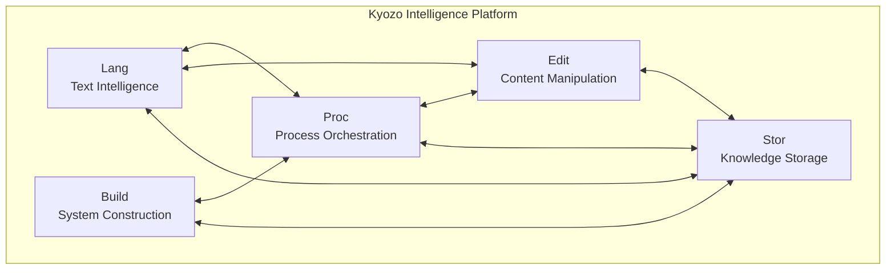

# Kyozo Developer Onboarding Guide
## Welcome to the Future of Universal Intelligence

### Table of Contents
1. [Welcome & Vision](#welcome--vision)
2. [Quick Start](#quick-start)
3. [Understanding Kyozo](#understanding-kyozo)
4. [Your First Integration](#your-first-integration)
5. [Development Workflow](#development-workflow)
6. [Best Practices](#best-practices)
7. [Resources & Support](#resources--support)

---

## 1. Welcome & Vision

Welcome to Kyozo, where we're redefining how software understands and processes information. You're not just joining a platform—you're joining a movement to make all text intelligently accessible.

### Our Mission
Transform every piece of text—code, documents, logs, or data—into actionable intelligence without requiring format-specific implementations.

### Why Kyozo?
- **Universal**: One platform for ALL text formats
- **Intelligent**: AI-enhanced understanding built-in
- **Composable**: Services that work better together
- **Zero-Friction**: Works with existing tools

## 2. Quick Start

### 2.1 Get Your API Key
```bash
# Sign up at https://kyozo.com/developers
export KYOZO_API_KEY="kyozo_live_sk_..."
```

### 2.2 Install SDK
```bash
# JavaScript/TypeScript
npm install @kyozo/sdk

# Python
pip install kyozo

# Go
go get github.com/kyozo/kyozo-go

# Elixir
mix deps.get kyozo
```

### 2.3 Your First Call
```javascript
import { Kyozo } from '@kyozo/sdk';

const kyozo = new Kyozo(process.env.KYOZO_API_KEY);

// Analyze any text
const result = await kyozo.lang.analyze({
  content: "Your text here - any format!",
  intelligence: ["semantic", "patterns", "suggestions"]
});

console.log(result.insights);
```

## 3. Understanding Kyozo

### 3.1 The Five Services



### 3.2 Core Concepts

#### Universal Text Model (UTM)
Every piece of text, regardless of format, is understood through:
- **Structure**: How it's organized
- **Semantics**: What it means
- **Intelligence**: What insights it contains
- **Relationships**: How it connects to other knowledge

#### Intelligence Mesh
Services don't just coexist—they enhance each other:
```javascript
// Example: Document → Analysis → Workflow → Storage
const document = await kyozo.lang.analyze(content);
const workflow = await kyozo.proc.createWorkflow(document.intelligence);
const enhanced = await kyozo.edit.optimize(document, workflow.suggestions);
await kyozo.stor.save(enhanced, { index: true, relate: true });
```

## 4. Your First Integration

### 4.1 Basic Text Analysis
```javascript
// Analyze a configuration file
const config = `
server:
  host: localhost
  port: 8080
  ssl: true
`;

const analysis = await kyozo.lang.analyze({
  content: config,
  options: {
    format: "auto",  // Auto-detects YAML
    intelligence: {
      semantic: true,
      validation: true,
      suggestions: true
    }
  }
});

// Results include:
// - Parsed structure
// - Semantic understanding (this is a server config)
// - Validation (SSL needs certificate paths)
// - Suggestions (add monitoring, logging configs)
```

### 4.2 Intelligent Transformation
```javascript
// Transform between formats with intelligence
const enhanced = await kyozo.lang.transform({
  source: {
    content: config,
    format: "yaml"
  },
  target: {
    format: "json",
    enhance: true  // Add intelligent defaults
  }
});

// Result includes missing best practices:
{
  "server": {
    "host": "localhost",
    "port": 8080,
    "ssl": {
      "enabled": true,
      "cert": "/path/to/cert.pem",  // Added
      "key": "/path/to/key.pem"      // Added
    },
    "monitoring": {                   // Added
      "healthcheck": "/health",
      "metrics": true
    }
  }
}
```

### 4.3 Building a Simple App
```javascript
// Create an intelligent log analyzer
class LogAnalyzer {
  constructor(apiKey) {
    this.kyozo = new Kyozo(apiKey);
  }

  async analyzeLogs(logFile) {
    // 1. Parse and understand logs
    const parsed = await this.kyozo.lang.analyze({
      content: logFile,
      format: "logs",
      intelligence: ["patterns", "anomalies", "timeline"]
    });

    // 2. Create analysis workflow
    const workflow = await this.kyozo.proc.execute({
      type: "log_analysis",
      input: parsed.intelligence,
      steps: ["group_errors", "find_root_causes", "suggest_fixes"]
    });

    // 3. Generate report
    const report = await this.kyozo.edit.create({
      template: "analysis_report",
      data: workflow.results,
      format: "markdown"
    });

    // 4. Store for future reference
    await this.kyozo.stor.save({
      content: report,
      metadata: {
        timestamp: new Date(),
        severity: workflow.results.maxSeverity,
        tags: ["logs", "analysis", parsed.timeRange]
      }
    });

    return report;
  }
}
```

## 5. Development Workflow

### 5.1 Local Development
```bash
# 1. Set up environment
cp .env.example .env
echo "KYOZO_API_KEY=your_key" >> .env

# 2. Install Kyozo CLI
npm install -g @kyozo/cli

# 3. Initialize project
kyozo init my-intelligent-app
cd my-intelligent-app

# 4. Start local intelligence server (for testing)
kyozo dev
```

### 5.2 Testing Intelligence
```javascript
import { KyozoTest } from '@kyozo/testing';

describe('Document Intelligence', () => {
  it('should extract key concepts', async () => {
    const result = await KyozoTest.analyze({
      content: "Test document about AI and ML",
      expectations: {
        concepts: ["artificial intelligence", "machine learning"],
        minConfidence: 0.8
      }
    });
    
    expect(result.passed).toBe(true);
  });
});
```

### 5.3 CI/CD Integration
```yaml
# .github/workflows/kyozo-intelligence.yml
name: Intelligence Tests
on: [push, pull_request]

jobs:
  test:
    runs-on: ubuntu-latest
    steps:
      - uses: actions/checkout@v2
      - uses: kyozo/intelligence-action@v1
        with:
          api-key: ${{ secrets.KYOZO_API_KEY }}
          benchmarks: ["KLUB-basic", "KIBI-1000"]
          min-score: 85
```

## 6. Best Practices

### 6.1 Intelligence-First Design
```javascript
// ❌ Don't: Format-specific implementations
if (format === 'json') {
  parseJSON(content);
} else if (format === 'xml') {
  parseXML(content);
}

// ✅ Do: Universal intelligence
const result = await kyozo.lang.analyze(content);
// Works with ANY format!
```

### 6.2 Service Composition
```javascript
// ✅ Compose services for complex operations
async function intelligentPipeline(content) {
  return await kyozo
    .lang.analyze(content)
    .then(result => kyozo.proc.enhance(result))
    .then(enhanced => kyozo.edit.optimize(enhanced))
    .then(optimized => kyozo.stor.index(optimized));
}
```

### 6.3 Error Handling
```javascript
// ✅ Intelligent error handling
try {
  const result = await kyozo.lang.analyze(content);
} catch (error) {
  if (error.code === 'FORMAT_UNKNOWN') {
    // Kyozo couldn't detect format, provide hint
    const result = await kyozo.lang.analyze(content, {
      format: 'custom',
      hints: ['config file', 'key-value pairs']
    });
  }
}
```

### 6.4 Performance Optimization
```javascript
// ✅ Use streaming for large files
const stream = kyozo.lang.analyzeStream({
  onChunk: (chunk) => {
    console.log(`Processed: ${chunk.progress}%`);
    console.log(`Insights so far: ${chunk.insights.length}`);
  }
});

stream.pipe(fileStream);
```

## 7. Resources & Support

### 7.1 Documentation
- **API Reference**: https://docs.kyozo.com/api
- **Service Guides**: https://docs.kyozo.com/services
- **Examples**: https://github.com/kyozo/examples
- **Benchmarks**: https://benchmarks.kyozo.com

### 7.2 Community
- **Discord**: https://discord.gg/kyozo
- **Forum**: https://forum.kyozo.com
- **Stack Overflow**: Tag `kyozo`
- **Twitter**: @kyozoplatform

### 7.3 Getting Help
```javascript
// Built-in debugging
const debug = await kyozo.debug({
  operation: "analyze",
  content: problematicContent,
  verbose: true
});

console.log(debug.suggestions);
```

### 7.4 Certification Path
1. **Kyozo Basic**: Complete tutorials
2. **Kyozo Standard**: Build a working integration
3. **Kyozo Advanced**: Pass intelligence benchmarks
4. **Kyozo Expert**: Contribute to the platform
5. **Kyozo Pioneer**: Define new standards

---

## Next Steps

1. **Complete the Tutorial**: Build your first intelligent app (30 min)
2. **Join the Community**: Get help and share ideas
3. **Explore Advanced Features**: Dive into specific services
4. **Get Certified**: Validate your expertise

Welcome to the intelligence revolution. Let's build something amazing together!

---

*"The best way to predict the future is to invent it."* - Alan Kay

With Kyozo, you're not just using AI—you're defining how AI understands information.