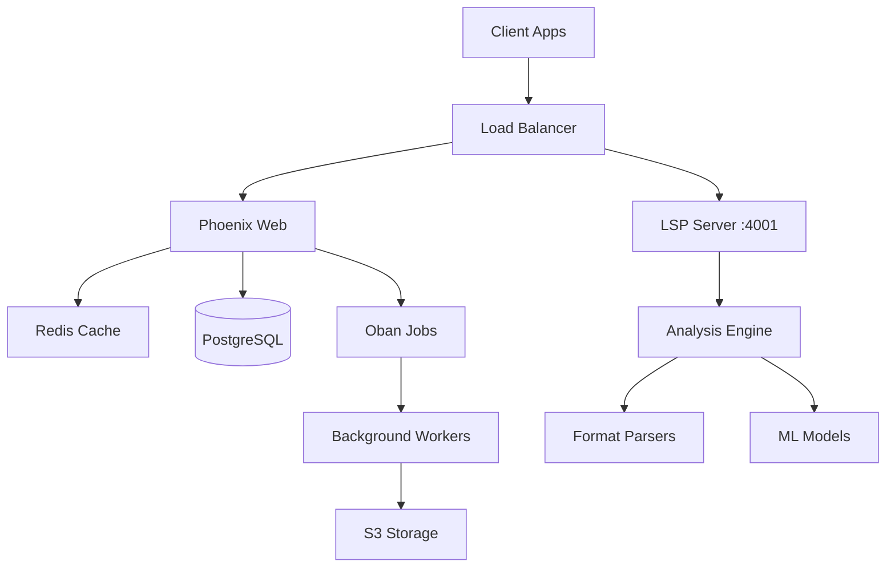

# 🛠️ LANG Technical Roadmap

## Overview

This technical roadmap provides detailed implementation plans for LANG's engineering team. It focuses on specific technical improvements, architectural decisions, and feature implementations.

## Current Architecture (v1.0)



## Phase 1: Foundation Enhancement (Q1 2025)

### 1.1 Performance Optimization Sprint (Weeks 1-4)

#### Parser Performance
```elixir
# Current: Sequential parsing
def analyze_content(content, format) do
  parse_content(content, format)
  |> perform_analysis()
  |> generate_completions()
end

# Target: Parallel processing with streaming
def analyze_content(content, format) do
  Task.async_stream([
    fn -> parse_content_streaming(content, format) end,
    fn -> analyze_chunks(content) end,
    fn -> prepare_completions(format) end
  ])
  |> Stream.map(&elem(&1, 1))
  |> Enum.reduce(&merge_results/2)
end
```

**Tasks:**
- [ ] Implement streaming parser for files >1MB
- [ ] Add chunk-based processing for large documents
- [ ] Implement parser result caching
- [ ] Add memory pooling for parser operations
- [ ] Benchmark and optimize hot paths

#### Database Optimization
```sql
-- Add indexes for common queries
CREATE INDEX idx_analyses_user_created 
  ON analyses(user_id, created_at DESC);

CREATE INDEX idx_documents_format_status 
  ON documents(format, status);

-- Add materialized view for analytics
CREATE MATERIALIZED VIEW user_usage_stats AS
  SELECT user_id, 
         COUNT(*) as total_analyses,
         AVG(processing_time) as avg_time
  FROM analyses
  GROUP BY user_id;
```

**Tasks:**
- [ ] Add missing database indexes
- [ ] Implement query result caching
- [ ] Add connection pooling optimization
- [ ] Set up read replicas for analytics
- [ ] Implement database query monitoring

### 1.2 Testing Infrastructure (Weeks 5-8)

#### Test Framework Enhancement
```elixir
# Property-based testing for parsers
defmodule Lang.ParserTest do
  use ExUnit.Case
  use ExUnitProperties

  property "parser handles any valid format content" do
    check all format <- format_generator(),
              content <- content_generator(format) do
      assert {:ok, _} = Parser.parse(content, format)
    end
  end
end
```

**Tasks:**
- [ ] Add property-based tests for all parsers
- [ ] Implement integration test suite
- [ ] Create load testing framework
- [ ] Add mutation testing
- [ ] Set up visual regression tests for UI

#### CI/CD Pipeline Enhancement
```yaml
# .github/workflows/ci.yml
name: CI
on: [push, pull_request]

jobs:
  test:
    runs-on: ubuntu-latest
    services:
      postgres:
        image: postgres:15
      redis:
        image: redis:7
    
    steps:
      - name: Run tests
        run: mix test --cover
      
      - name: Check coverage
        run: mix coveralls.github
        
      - name: Security scan
        run: mix sobelow --config
        
      - name: Performance tests
        run: mix run benchmarks/run.exs
```

**Tasks:**
- [ ] Set up GitHub Actions for CI/CD
- [ ] Add automated security scanning
- [ ] Implement performance regression tests
- [ ] Add automatic dependency updates
- [ ] Create deployment preview environments

### 1.3 Developer Experience (Weeks 9-12)

#### SDK Development
```python
# Python SDK Example
from lang import Client, Analysis

client = Client(api_key="your_key")

# Simple analysis
result = client.analyze(
    content="# Hello World",
    format="markdown"
)

# Streaming analysis
async for chunk in client.analyze_stream(large_content):
    print(f"Progress: {chunk.progress}%")
```

**Tasks:**
- [ ] Create Python SDK with full API coverage
- [ ] Build JavaScript/TypeScript SDK
- [ ] Develop Go client library
- [ ] Create Ruby gem
- [ ] Build Rust crate

#### VS Code Extension
```typescript
// Extension features
export function activate(context: vscode.ExtensionContext) {
  // Real-time analysis
  const analyzer = new LangAnalyzer();
  
  // Register providers
  context.subscriptions.push(
    vscode.languages.registerCompletionItemProvider(
      '*', analyzer, '.', ':', '->'
    ),
    vscode.languages.registerHoverProvider(
      '*', analyzer
    ),
    vscode.languages.registerCodeActionsProvider(
      '*', analyzer
    )
  );
}
```

**Tasks:**
- [ ] Create VS Code extension scaffold
- [ ] Implement real-time analysis
- [ ] Add inline suggestions
- [ ] Create configuration UI
- [ ] Publish to marketplace

## Phase 2: Intelligence Enhancement (Q2 2025)

### 2.1 AI Integration Architecture

```elixir
# AI Service Abstraction
defmodule Lang.AI.Service do
  @callback analyze(content :: String.t, options :: map()) :: 
    {:ok, Analysis.t} | {:error, term()}
  
  @callback complete(prompt :: String.t, context :: map()) :: 
    {:ok, [Completion.t]} | {:error, term()}
end

# Multiple Provider Support
defmodule Lang.AI.Orchestrator do
  def analyze(content, options) do
    providers = [
      {Lang.AI.OpenAI, weight: 0.5},
      {Lang.AI.Anthropic, weight: 0.3},
      {Lang.AI.Local, weight: 0.2}
    ]
    
    # Weighted consensus from multiple providers
    providers
    |> Enum.map(fn {provider, weight} ->
      Task.async(fn -> 
        {provider.analyze(content, options), weight}
      end)
    end)
    |> Task.await_many()
    |> weighted_consensus()
  end
end
```

**Tasks:**
- [ ] Design AI service abstraction layer
- [ ] Integrate OpenAI GPT-4 API
- [ ] Add Anthropic Claude support
- [ ] Implement local model support (Ollama)
- [ ] Build prompt engineering framework
- [ ] Create model performance monitoring

### 2.2 Advanced Analysis Features

#### Semantic Search Implementation
```elixir
# Vector embeddings for semantic search
defmodule Lang.Search.Semantic do
  def index_document(document) do
    # Generate embeddings
    embeddings = AI.generate_embeddings(document.content)
    
    # Store in vector database
    Pgvector.insert(%{
      document_id: document.id,
      embeddings: embeddings,
      metadata: extract_metadata(document)
    })
  end
  
  def search(query, options \\ []) do
    query_embedding = AI.generate_embeddings(query)
    
    Pgvector.search(
      query_embedding,
      limit: options[:limit] || 10,
      threshold: options[:threshold] || 0.8
    )
  end
end
```

**Tasks:**
- [ ] Implement vector embeddings generation
- [ ] Set up pgvector for PostgreSQL
- [ ] Create semantic search API
- [ ] Add search result ranking
- [ ] Implement search analytics

### 2.3 Real-time Collaboration

```elixir
# Phoenix Channels for collaboration
defmodule LangWeb.DocumentChannel do
  use Phoenix.Channel
  
  def join("document:" <> doc_id, _params, socket) do
    # Track presence
    {:ok, _} = Presence.track(socket, doc_id, %{
      user_id: socket.assigns.user_id,
      cursor: nil
    })
    
    # Send current state
    {:ok, %{document: get_document(doc_id)}, socket}
  end
  
  def handle_in("cursor:move", %{"position" => pos}, socket) do
    broadcast!(socket, "cursor:moved", %{
      user_id: socket.assigns.user_id,
      position: pos
    })
    {:noreply, socket}
  end
  
  def handle_in("content:change", %{"delta" => delta}, socket) do
    # Apply operational transform
    {:ok, transformed} = OT.transform(delta, socket.assigns.doc_version)
    
    # Broadcast to others
    broadcast_from!(socket, "content:changed", %{
      delta: transformed,
      version: socket.assigns.doc_version + 1
    })
    
    {:noreply, update_version(socket)}
  end
end
```

**Tasks:**
- [ ] Implement Phoenix Channels for documents
- [ ] Add operational transformation (OT)
- [ ] Create presence tracking
- [ ] Build conflict resolution
- [ ] Add collaboration analytics

## Phase 3: Platform Scale (Q3-Q4 2025)

### 3.1 Microservices Architecture

```yaml
# docker-compose.yml for microservices
version: '3.8'

services:
  api_gateway:
    build: ./api_gateway
    ports:
      - "4000:4000"
    
  auth_service:
    build: ./services/auth
    environment:
      - SERVICE_NAME=auth
    
  parser_service:
    build: ./services/parser
    deploy:
      replicas: 5
    
  analysis_service:
    build: ./services/analysis
    deploy:
      replicas: 3
    
  ml_service:
    build: ./services/ml
    deploy:
      resources:
        reservations:
          devices:
            - driver: nvidia
              count: 1
              capabilities: [gpu]
```

**Tasks:**
- [ ] Design microservices architecture
- [ ] Implement service mesh (Istio/Linkerd)
- [ ] Add API gateway (Kong/Envoy)
- [ ] Set up service discovery
- [ ] Implement distributed tracing

### 3.2 Multi-Region Deployment

```terraform
# Infrastructure as Code
resource "aws_ecs_service" "lang_api" {
  for_each = var.regions
  
  name            = "lang-api-${each.key}"
  cluster         = aws_ecs_cluster.main[each.key].id
  task_definition = aws_ecs_task_definition.api.arn
  desired_count   = var.api_instance_count[each.key]
  
  load_balancer {
    target_group_arn = aws_lb_target_group.api[each.key].arn
    container_name   = "api"
    container_port   = 4000
  }
}

# Global load balancing
resource "aws_route53_record" "api" {
  zone_id = aws_route53_zone.main.zone_id
  name    = "api.lang-platform.dev"
  type    = "A"
  
  alias {
    name                   = aws_cloudfront_distribution.api.domain_name
    zone_id                = aws_cloudfront_distribution.api.hosted_zone_id
    evaluate_target_health = true
  }
}
```

**Tasks:**
- [ ] Set up multi-region infrastructure
- [ ] Implement global load balancing
- [ ] Add geo-routing
- [ ] Create data replication strategy
- [ ] Implement region failover

### 3.3 Performance Monitoring

```elixir
# Custom telemetry events
defmodule Lang.Telemetry do
  def setup do
    # Attach handlers
    :telemetry.attach_many(
      "lang-metrics",
      [
        [:lang, :api, :request, :start],
        [:lang, :api, :request, :stop],
        [:lang, :parser, :parse, :stop],
        [:lang, :ml, :inference, :stop]
      ],
      &handle_event/4,
      nil
    )
  end
  
  def handle_event([:lang, :api, :request, :stop], measurements, metadata, _) do
    # Send to monitoring service
    Prometheus.Histogram.observe(
      :api_request_duration_seconds,
      measurements.duration / 1_000_000_000,
      [endpoint: metadata.endpoint]
    )
    
    # Alert on slow requests
    if measurements.duration > 1_000_000_000 do
      Logger.warn("Slow API request", metadata)
      Sentry.capture_message("Slow API request", extra: metadata)
    end
  end
end
```

**Tasks:**
- [ ] Implement comprehensive telemetry
- [ ] Set up Prometheus + Grafana
- [ ] Add distributed tracing (Jaeger)
- [ ] Create SLO/SLA monitoring
- [ ] Build custom dashboards

## Phase 4: Innovation Platform (2026+)

### 4.1 Plugin Architecture

```elixir
# Plugin system design
defmodule Lang.Plugins.Engine do
  defmacro __using__(opts) do
    quote do
      @behaviour Lang.Plugins.Behaviour
      
      def manifest do
        %{
          name: unquote(opts[:name]),
          version: unquote(opts[:version]),
          author: unquote(opts[:author]),
          capabilities: unquote(opts[:capabilities])
        }
      end
    end
  end
end

# Example plugin
defmodule CustomSecurityAnalyzer do
  use Lang.Plugins.Engine,
    name: "Security Analyzer",
    version: "1.0.0",
    capabilities: [:analyze, :report]
  
  @impl true
  def analyze(content, format) do
    # Custom security analysis logic
    vulnerabilities = SecurityScanner.scan(content, format)
    {:ok, %{vulnerabilities: vulnerabilities}}
  end
end
```

**Tasks:**
- [ ] Design plugin API
- [ ] Create plugin marketplace
- [ ] Implement sandboxed execution
- [ ] Add plugin versioning
- [ ] Build developer tools

### 4.2 Machine Learning Pipeline

```python
# Custom model training pipeline
class LangModelTrainer:
    def __init__(self):
        self.pipeline = Pipeline([
            ('preprocessor', LangPreprocessor()),
            ('embedder', UniversalSentenceEncoder()),
            ('model', TransformerModel())
        ])
    
    def train(self, dataset):
        # Distributed training
        strategy = tf.distribute.MirroredStrategy()
        
        with strategy.scope():
            model = self.build_model()
            model.compile(
                optimizer='adam',
                loss='categorical_crossentropy',
                metrics=['accuracy']
            )
        
        # Train with checkpointing
        model.fit(
            dataset,
            callbacks=[
                ModelCheckpoint('model_checkpoint'),
                TensorBoard(log_dir='./logs'),
                EarlyStopping(patience=3)
            ]
        )
```

**Tasks:**
- [ ] Build ML training pipeline
- [ ] Create model versioning system
- [ ] Implement A/B testing framework
- [ ] Add AutoML capabilities
- [ ] Build model monitoring

## Technical Debt Priorities

### Immediate (Q1 2025)
1. **Refactor LSP server** - Better separation of concerns
2. **Standardize error handling** - Consistent error types
3. **Improve test coverage** - Focus on edge cases
4. **Update dependencies** - Elixir 1.16, Phoenix 1.8

### Short-term (Q2 2025)
1. **Database schema optimization** - Better indexing
2. **API versioning** - Prepare for v2
3. **Logging standardization** - Structured logging
4. **Documentation automation** - Generate from code

### Long-term (Q3-Q4 2025)
1. **Event sourcing** - For audit trail
2. **CQRS implementation** - Separate read/write
3. **GraphQL federation** - For microservices
4. **Service mesh** - For distributed system

## Innovation Projects

### Research Areas
1. **Quantum-resistant cryptography** - Future-proof security
2. **Edge AI deployment** - Local processing
3. **Blockchain integration** - Decentralized verification
4. **WebAssembly plugins** - Universal plugin format
5. **Neural architecture search** - AutoML for text

### Experimental Features
1. **Voice-controlled coding** - Natural language programming
2. **AR code reviews** - Spatial visualization
3. **Predictive debugging** - AI-powered bug prevention
4. **Cross-language transpilation** - Universal code converter
5. **Semantic IDE** - Intent-based development

---

## Resource Allocation

### Q1 2025
- Backend Engineers: 3
- Frontend Engineers: 2
- DevOps: 1
- QA: 1

### Q2 2025
- Backend Engineers: 5
- Frontend Engineers: 3
- ML Engineers: 2
- DevOps: 2
- QA: 2

### Q3-Q4 2025
- Backend Engineers: 8
- Frontend Engineers: 5
- ML Engineers: 4
- DevOps: 3
- QA: 3
- Security: 2

---

*This technical roadmap is reviewed bi-weekly and updated based on performance metrics, user feedback, and technical discoveries.*