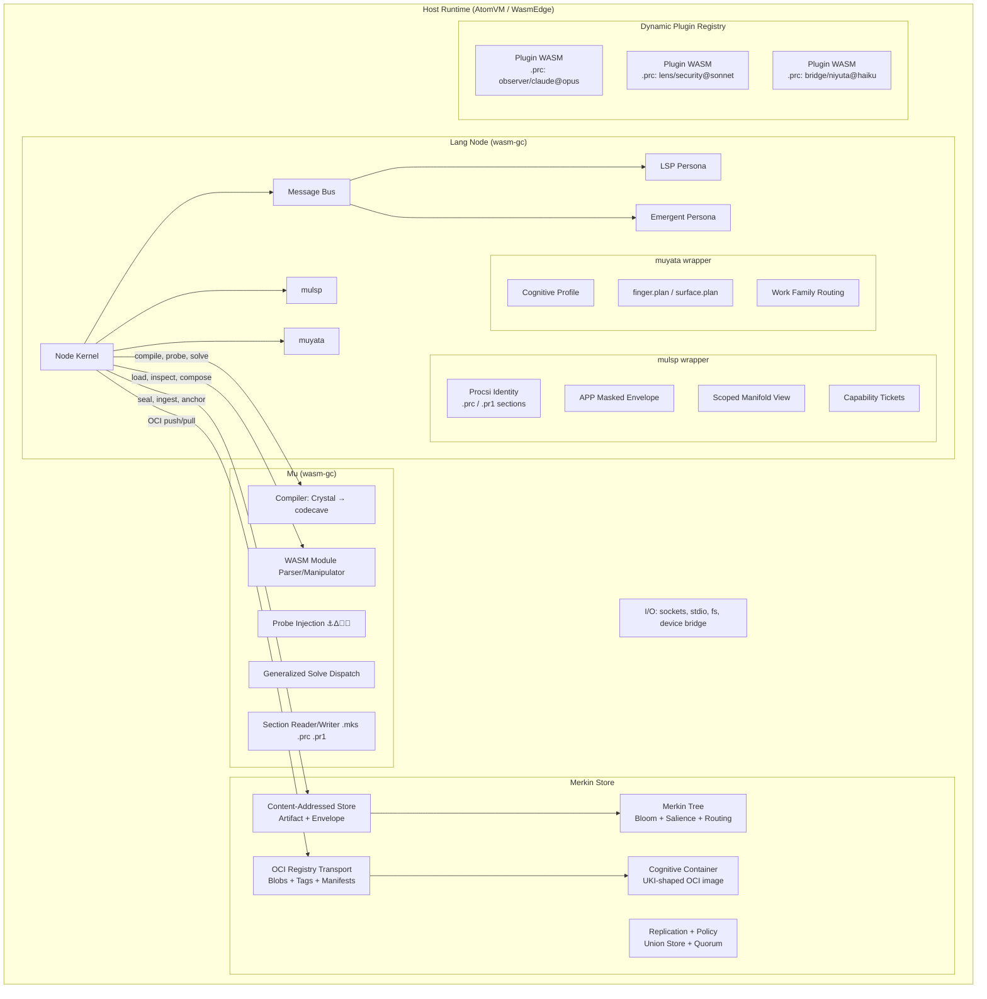

# Unified Node Architecture v3 — The Mu / Merkin / Lang Trio

## The Trio

These three projects form a single composable system. Each has a clear boundary:

| Project | Role | Boundary |
|---------|------|----------|
| **Merkin** (`zpc/merkin`) | **Store** — structural substrate | Addressing, roots, envelopes, routing, trees, replication, OCI transport |
| **Mu** (`zpc/mu`) | **Execute** — computation facility | Compilation, probes, solve dispatch, codec operations, wasm manipulation |
| **Lang** (`zpc/lang`) | **Node** — runtime binary | LSP proxy, emergent persona, plugin hosting, mulsp/muyata wrappers, finger discovery |

The rule from the specs: *Merkin names and stores the problem. Mu performs or brokers the work. FSMs (in Lang) resolve handles and move work across queues.*

---

## What Changed from v2

1. **Merkin as the store** — formalized. Merkin isn't just a library; it's the structural substrate that backs the node's CAS, OCI transport, tree indexing, and replication. The plan now defines how Merkin packages node state as OCI-compatible containers.

2. **UKI/Container/OCI model** — the node's state (void, loaded plugins, tree, bloom, procsi identity) is a Merkin-stored cognitive container, OCI-transportable. This is how nodes replicate, checkpoint, and exchange state.

3. **Mu's role clarified** — Mu isn't a runtime *host*; it's the execution facility the node calls for compilation, solve dispatch, probing, and wasm manipulation. The node kernel (in Lang) delegates work to Mu.

4. **mulsp/muyata as wrappers** — per the new specs, mulsp wraps AI execution identity + scoped manifold, muyata wraps AI-shaped Yata semantic work. Both live in Lang, layered above Merkin substrate and Mu execution.

5. **Wasm custom sections** — the `.mks`, `.prc`, `.pr1` binary section specs from MU_RUNTIME_SPEC are first-class. Every plugin wasm carries its own procsi identity and solve cursor.

---

## Architecture



---

## Merkin as Store — UKI / Container / OCI Model

### The Problem

The node needs to:
- Checkpoint its entire state (void, tree, bloom, loaded plugins, procsi) as a portable blob
- Exchange that state over OCI transport (push/pull like a container image)
- Support UKI-style self-contained bootable cognitive containers
- Enable peer nodes to replicate selectively via sparse tree projections

### The Model: Cognitive Container

A **cognitive container** is an OCI-compatible image whose layers are Merkin artifacts:

```
cognitive-container/
├── manifest.json              # OCI manifest pointing to layers
├── layers/
│   ├── void.blob              # serialized Void state
│   ├── tree.blob              # serialized MerkinTree snapshot  
│   ├── bloom.blob             # serialized BloomSketch
│   ├── plugins/               # each plugin wasm as a layer
│   │   ├── observer-claude.wasm   (carries .prc .pr1 .mks sections)
│   │   ├── lens-security.wasm
│   │   └── bridge-niyuta.wasm
│   ├── procsi.pr1             # node-level .pr1 attestation
│   └── config.muon            # node configuration in MUON
└── annotations                # OCI annotations with finger.plan summary
```

### Media Types

| Content | OCI Media Type |
|---------|---------------|
| Void state | `application/vnd.merkin.void.v1` |
| Tree snapshot | `application/vnd.merkin.tree.v1` |
| Bloom sketch | `application/vnd.merkin.bloom.v1` |
| Plugin wasm | `application/vnd.mu.plugin.wasm-gc.v1` |
| Codecave artifact | `application/vnd.mu.codecave.v1` |
| Procsi attestation | `application/vnd.mu.procsi.pr1.v1` |
| Node config | `application/vnd.merkin.config.muon.v1` |
| Cognitive container manifest | `application/vnd.merkin.cognitive.manifest.v1+json` |

### OCI Distribution

Cognitive containers use standard OCI distribution:
- `PUT /v2/<repo>/blobs/uploads/` for layer upload  
- `PUT /v2/<repo>/manifests/<tag>` for manifest
- Tags follow Merkin epoch convention: `epoch-<n>`, `latest`

Merkin's existing `OciCasNode` and `InMemoryOciRegistry` become the backing store. The upgrade path is:
1. Current: in-memory registry for testing
2. Next: filesystem-backed registry (parallel to `FsCasStore`)
3. Future: actual OCI distribution registry (Harbor, GHCR, etc.)

### UKI Parallel

UKI (Unified Kernel Image) bundles kernel + initrd + cmdline into a single signed EFI binary. Similarly, a cognitive container bundles:

| UKI Component | Cognitive Container Equivalent |
|---|---|
| Kernel | Node wasm module (Lang) |
| initrd | Plugin wasms + void state |
| cmdline | Config MUON |
| Signature | .pr1 attestation + APP envelope |

A cognitive container is a single artifact that a host runtime can boot:
1. Load node wasm
2. Unpack layers into memory
3. Restore void state, tree, bloom
4. Load plugins
5. Node is ready to serve

---

## Proposed Changes

### Merkin: Store Layer Additions

#### [NEW] [container.mbt](file:///home/locnguyen/ratio/merkin/storage/container.mbt)

Cognitive container packing/unpacking:

```moonbit
pub(all) struct CognitiveContainer {
  manifest     : ContainerManifest
  void_layer   : Bytes                  // serialized Void
  tree_layer   : Bytes                  // serialized tree snapshot
  bloom_layer  : Bytes                  // serialized bloom
  plugin_layers : Array[PluginLayer]    // wasm bytes + procsi
  procsi_layer : Bytes                  // node-level .pr1
  config_layer : Bytes                  // MUON config
}

pub(all) struct PluginLayer {
  name       : String
  wasm_bytes : Bytes
  procsi     : Bytes                    // extracted .prc/.pr1 section bytes
  mks_state  : Bytes?                   // optional .mks solve cursor
}

pub(all) struct ContainerManifest {
  schema_version : Int
  media_type     : String
  layers         : Array[LayerDescriptor]
  annotations    : Map[String, String]  // includes finger.plan summary
}

pub(all) struct LayerDescriptor {
  media_type : String
  digest     : @hash.Hash
  size       : Int
  annotations : Map[String, String]
}

pub fn CognitiveContainer::pack(node_state : NodeState) -> CognitiveContainer
pub fn CognitiveContainer::unpack(container : CognitiveContainer) -> NodeState
pub fn CognitiveContainer::to_oci(self : CognitiveContainer, registry : OciCasNode) -> @hash.Hash
pub fn CognitiveContainer::from_oci(registry : OciCasNode, tag : String) -> CognitiveContainer?
```

#### [MODIFY] [oci.mbt](file:///home/locnguyen/ratio/merkin/storage/oci.mbt)

Add manifest support — OCI manifests are JSON blobs stored alongside regular blobs:

```moonbit
pub fn InMemoryOciRegistry::put_manifest(
  self : InMemoryOciRegistry,
  repository : String,
  tag : String,
  manifest : Bytes,
) -> String

pub fn InMemoryOciRegistry::get_manifest(
  self : InMemoryOciRegistry,
  repository : String,
  tag : String,
) -> Bytes?
```

---

### Mu: Execution Additions

#### [MODIFY] [module.mbt](file:///home/locnguyen/ratio/mu/mbt/wasm/module.mbt)

The wasm Module parser already exists and is solid. Add custom section extraction for `.mks`, `.prc`, `.pr1`:

```moonbit
/// Extract all custom sections with a given name
pub fn Module::custom_sections(self : Module, name : String) -> Array[RawSection]

/// Extract .prc procsi identity from a wasm module  
pub fn Module::extract_prc(self : Module) -> ProcsiIdentity?

/// Extract .pr1 Genius attestation from a wasm module
pub fn Module::extract_pr1(self : Module) -> GeniusAttestation?

/// Extract .mks solve cursor from a wasm module
pub fn Module::extract_mks(self : Module) -> SolveCursor?
```

#### [NEW] [sections.mbt](file:///home/locnguyen/ratio/mu/mbt/wasm/sections.mbt)

Binary section reader/writer per the MU_RUNTIME_SPEC §6:

```moonbit
/// .mks section — mutable solve/runtime state cursor
pub(all) struct SolveCursor {
  cursor  : Int       // remaining runs
  total   : Int       // original run count
  items   : Array[SolveItem]
}

pub(all) struct SolveItem {
  item_type : String  // "merge_pr", "answer_jules", "repair", "smt", etc.
  arg       : String  // target or principal argument
}

/// .prc section — procsi compile/runtime identity
pub(all) struct ProcsiIdentity {
  locus        : String
  project      : String
  tier         : String
  context_hash : Array[Byte]  // 32 bytes
}

/// .pr1 section — APP-masked Genius procsi attestation
pub(all) struct GeniusAttestation {
  locus                 : String       // may be empty
  project               : String
  ratio_loci            : String
  session_surface       : String
  fingerprint_commitment : Array[Byte] // 32 bytes
  app_protocol          : String
  app_audience          : String
  app_ref               : String
  app_payload_hash      : Array[Byte]  // 32 bytes
  context_hash          : Array[Byte]  // 32 bytes
  policy_hash           : Array[Byte]  // 32 bytes
}

pub fn SolveCursor::parse(payload : Array[Byte]) -> SolveCursor?
pub fn SolveCursor::encode(self : SolveCursor) -> Array[Byte]
pub fn ProcsiIdentity::parse(payload : Array[Byte]) -> ProcsiIdentity?
pub fn ProcsiIdentity::encode(self : ProcsiIdentity) -> Array[Byte]
pub fn GeniusAttestation::parse(payload : Array[Byte]) -> GeniusAttestation?
pub fn GeniusAttestation::encode(self : GeniusAttestation) -> Array[Byte]
```

#### [NEW] [compose.mbt](file:///home/locnguyen/ratio/mu/mbt/wasm/compose.mbt)

Wasm module composition — wire one module's exports to another's imports:

```moonbit
/// Compose overlay onto base: overlay's imports satisfied by base's exports
pub fn compose_modules(base : Module, overlay : Module) -> Array[Byte]

/// Inject a custom section into an existing wasm binary
pub fn inject_section(wasm : Array[Byte], name : String, payload : Array[Byte]) -> Array[Byte]

/// Strip a custom section from a wasm binary
pub fn strip_section(wasm : Array[Byte], name : String) -> Array[Byte]

/// Hot-patch .mks section (update solve cursor without recompiling)
pub fn patch_mks(wasm : Array[Byte], new_mks : SolveCursor) -> Array[Byte]
```

---

### Lang: Node Binary

#### [NEW] `zpc/lang/node/` — Kernel (from v2 plan, adjusted)

Node struct now explicitly carries mulsp + muyata wrappers and delegates to Merkin store + Mu execution:

```moonbit
pub(all) struct Node {
  node_id      : String
  mode         : NodeMode
  // Merkin store backing
  store        : @merkin.UnionStore
  tree         : @merkin.MerkinTree
  bloom        : @merkin.BloomSketch
  // Mu execution
  mu_caps      : MuCapabilities       // what mu can do
  // Wrappers
  mulsp        : MulspState           // AI runtime identity
  muyata       : MuyataProfile        // AI-shaped work view
  // State
  void_state   : @void.Void
  plugin_reg   : PluginRegistry
  bus          : MessageBus
  finger       : FingerState
  container    : ContainerState       // current container epoch/tag info
}
```

#### [NEW] `zpc/lang/mulsp/` — AI Runtime Wrapper

Per MULSP_SPEC: the AI-specific wrapper around execution and scoped manifold:

```moonbit
pub(all) struct MulspState {
  mulsp_id              : @hash.Hash
  ratio_loci            : String
  genius_loci           : String?
  scope_root            : @hash.Hash?
  projection_root       : @hash.Hash?
  procsi_ref            : ProcsiRef?
  fingerprint_commitment : @hash.Hash?
  app_ref               : AppRef?
  capability_refs       : Array[@hash.Hash]
  execution_surface     : String
  handler               : String
  residue_ref           : @hash.Hash?
  trail_ref             : @hash.Hash?
  checkpoint_ref        : @hash.Hash?
  parent_mulsp_refs     : Array[@hash.Hash]
  lifecycle             : MulspLifecycle
}

pub(all) enum MulspLifecycle {
  Dormant       // container exists, no Genius Loci attached
  Attached      // AI attached with scoped view
  Active        // AI executing, emitting residue
  Delegated     // child mulsp packets emitted
  Quiescent     // no active AI, traces replayable
  Revoked       // epoch invalidated
}
```

#### [NEW] `zpc/lang/muyata/` — AI-Shaped Yata Profile

Per MUYATA_SPEC: the AI-specific wrapping around Yata work:

```moonbit
pub(all) struct MuyataProfile {
  overlay              : String      // e.g. "claude", "codex", "chatgpt"
  family               : String      // e.g. "anthropic", "openai"
  mode                 : String      // e.g. "haiku", "sonnet", "opus"
  intent               : WorkIntent
  execution_surface    : String
  handler              : String
  procsi_ref           : ProcsiRef?
  fingerprint_commitment : @hash.Hash?
  capability_class     : String
}

pub(all) enum WorkIntent {
  Observation
  Compilation
  Delegation
  Resolution
  Audit
  Translation
}
```

#### Plans

All remaining packages from v2 (finger, gmu, cert, wasm_iface, plugin, emergent, lsp/proxy) carry forward unchanged.

---

## Package Map (Complete Trio)

```
zpc/merkin (the store)
├── hash/           — blake3 hashing
├── bloom/          — BloomSketch
├── gaussian/       — GaussianField (salience)
├── tree/           — MerkinTree, SparseMerkinTree, diff
├── model/          — Artifact, Envelope, Yata, Residue, Procsi identity types
├── storage/        — StoreNode trait, ArtifactCasNode, OciCasNode, UnionStore
│   ├── oci.mbt     — OCI registry (add manifest support)
│   └── container.mbt [NEW] — Cognitive container pack/unpack/OCI
├── daemon/         — DaemonNode (OCI facility modes)
├── api/            — wasm export surface
├── wasm_entry/     — existing wasm bridge (stays as reference)
└── docs/           — MULSP_SPEC, MUYATA_SPEC, MU_RUNTIME_SPEC, SUBSTRATE_SPEC

zpc/mu (the executor)  
├── parser/         — mu language parser
├── ir/             — Crystal IR (symbols, probes, fragments)
├── compiler/       — Crystal → codecave compilation
├── runtime/        — harness, instrumentation, salience
├── wasm/           — WASM module parser + manipulator
│   ├── module.mbt  — parse wasm binary (add custom section extraction)
│   ├── sections.mbt [NEW] — .mks/.prc/.pr1 read/write
│   ├── compose.mbt [NEW] — module composition + section injection
│   ├── probe.mbt   — probe injection (⚓Δ🔬💉)
│   └── inject.mbt  — opcode-level injection
├── merkin/         — bridge: crystal → merkin seal + OCI push
├── forge/          — binary forging
├── manifold/       — mu manifold operations
├── mcp/            — MCP server integration
└── muon/           — MUON format parser

zpc/lang (the node)
├── lsp/            — LSP frame codec + message classification + proxy
├── node/           [NEW] — kernel (Node, bus, cas wrapper, host externs)
├── mulsp/          [NEW] — AI runtime wrapper (per MULSP_SPEC)
├── muyata/         [NEW] — AI-shaped Yata profile (per MUYATA_SPEC)
├── wasm_iface/     [NEW] — direct WASM manipulation surface
├── plugin/         [NEW] — dynamic plugin system (registry, ABI)
├── finger/         [NEW] — Finger + GMU/1 + FINGER-CERT
├── emergent/       [NEW] — emergent persona (bloom, tree, stigmergy)
├── yata/           — void + claude_process (reference plugin build)
└── cmd/            [NEW] — CLI entry point
```

---

## Execution Phases

### Phase 1: Merkin Container Layer
Add `container.mbt` to `zpc/merkin/storage`. Implement pack/unpack for cognitive containers. Add manifest support to OCI registry. **Test: round-trip a container through in-memory OCI.**

### Phase 2: Mu Section Parser/Writer
Add `sections.mbt` and `compose.mbt` to `zpc/mu/mbt/wasm`. Parse/write `.mks`, `.prc`, `.pr1` from wasm custom sections. Add `Module::custom_sections` to existing module parser. **Test: parse a wasm with injected procsi sections, round-trip.**

### Phase 3: Lang Node Kernel
Build `zpc/lang/node` — Node struct, host externs, bus, cas wrapper delegating to Merkin store. **Test: compile to wasm-gc.**

### Phase 4: mulsp + muyata Wrappers
Build `zpc/lang/mulsp` and `zpc/lang/muyata` per specs. These are mostly data structures + lifecycle state machines. **Test: mulsp lifecycle transitions, muyata profile generation.**

### Phase 5: Plugin System + WASM Interface
Build `zpc/lang/plugin` and `zpc/lang/wasm_iface`. Load plugins by CAS hash through Mu's module parser. Route bus messages to plugin exports. Expose manipulation surface. **Test: load plugin wasm, deliver bus message, read output.**

### Phase 6: LSP + Emergent Personas
Port LSP proxy loop and emergent daemon logic into Lang, wired through bus. **Test: LSP frame round-trip, OCI put/get through emergent persona.**

### Phase 7: Finger + GMU/1
Build discovery layer per Avici specs. Generate finger.plan from node state. Parse/emit GMU/1 messages. **Test: finger.plan generation, GMU/1 round-trip.**

### Phase 8: Container Boot
End-to-end: pack a node's state as cognitive container → push to OCI → pull on another node → unpack → boot. **Test: full container lifecycle.**

---

## Open Questions

> [!IMPORTANT]
> **Container signing**: The `.pr1` attestation is carried per-plugin and per-container. Should container manifests also include a top-level signature? The FINGER-CERT spec has signing primitives — do those apply here, or is container signing purely an APP/procsi concern?

> [!IMPORTANT]
> **Mu as a separate wasm module vs linked**: Currently `zpc/mu` depends on `zpc/merkin` at build time. Under the node architecture, should Mu also be a wasm-gc module loaded separately (like a plugin), or should it be statically linked into the node wasm? Separate loading gives more flexibility but adds call overhead. Static linking is simpler but makes the node binary bigger.

> [!IMPORTANT]
> **OCI distribution target**: The in-memory OCI registry is test-only. For real distribution, do you want to target a specific OCI registry (GHCR, Harbor, Kyozo Store from your `kyozo_store` project), or keep it registry-agnostic with just the distribution API?

## Verification Plan

### Automated Tests
- `moon test` in all three repos (merkin, mu, lang)
- `moon build --target wasm-gc` for lang node — must link
- Container round-trip: pack → OCI push → OCI pull → unpack → verify state equality
- Section round-trip: inject .prc into wasm → parse → verify fields match
- Plugin lifecycle: load plugin → bus message → plugin output → void update

### Manual Verification
- Build cognitive container from live node state, inspect with `skopeo` or equivalent
- Boot container on WasmEdge, verify node serves LSP
- Peer exchange: two nodes share containers via Finger + OCI pull
