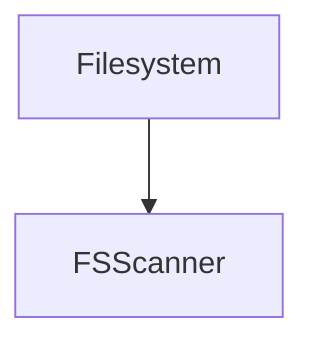

# Parser Dependencies Report

Generated: 2025-08-23 08:10:11.688095Z

## Summary

| Parser | Files Using | Total Calls | Most Used Function |
|--------|-------------|-------------|-------------------|
| Lang.GraphReasoner | 1 | 0 | none |
| Lang.Native.FSScanner | 0 | 0 | none |
| Lang.Native.FSWatcher | 0 | 0 | none |
| Lang.Native.Parser | 2 | 21 | analyze_style (2 calls) |
| Lang.Native.PerfEngine | 2 | 24 | health_check (2 calls) |
| Lang.Native.TreeParser | 1 | 17 | analyze_code_complete (1 calls) |
| Lang.Parsers.Filesystem | 0 | 0 | none |

## Detailed Analysis

### Lang.GraphReasoner

**Usage Statistics:**
- Files using this parser: 1
- Unique functions called: 0  
- Total function calls: 0

**Top Functions:**

### Lang.Native.FSScanner

**Usage Statistics:**
- Files using this parser: 0
- Unique functions called: 0  
- Total function calls: 0

**Top Functions:**

### Lang.Native.FSWatcher

**Usage Statistics:**
- Files using this parser: 0
- Unique functions called: 0  
- Total function calls: 0

**Top Functions:**

### Lang.Native.Parser

**Usage Statistics:**
- Files using this parser: 2
- Unique functions called: 16  
- Total function calls: 21

**Top Functions:**
- `analyze_style/n` - 2 calls
- `clear_caches/n` - 2 calls
- `compare_styles/n` - 2 calls
- `get_performance_stats/n` - 2 calls
- `parse_content/n` - 2 calls

### Lang.Native.PerfEngine

**Usage Statistics:**
- Files using this parser: 2
- Unique functions called: 21  
- Total function calls: 24

**Top Functions:**
- `health_check/n` - 2 calls
- `memory_stats/n` - 2 calls
- `semantic_diff_complete/n` - 2 calls
- `batch_hash_triples/n` - 1 calls
- `batch_semantic_diff/n` - 1 calls

### Lang.Native.TreeParser

**Usage Statistics:**
- Files using this parser: 1
- Unique functions called: 17  
- Total function calls: 17

**Top Functions:**
- `analyze_code_complete/n` - 1 calls
- `analyze_complexity/n` - 1 calls
- `analyze_semantic_structure/n` - 1 calls
- `build_dependency_graph/n` - 1 calls
- `check_architectural_rules/n` - 1 calls

### Lang.Parsers.Filesystem

**Usage Statistics:**
- Files using this parser: 0
- Unique functions called: 0  
- Total function calls: 0

**Top Functions:**

## Dependency Graph

## Migration Impact

### High Impact Parsers (>50 calls)

